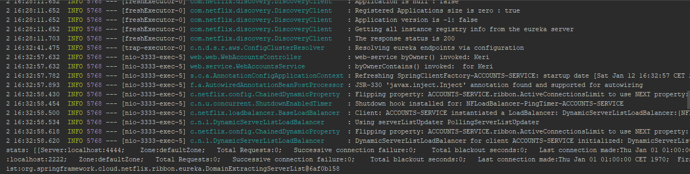

**The microservices are running at the start**

Account

WebServer

**And they are registrated as we can see here**

**Now we add another account microservice changing the port in aplicacion.yaml file of account**

**When one account microservice has fallen the load balancer replace it with the other one and web server still working**

